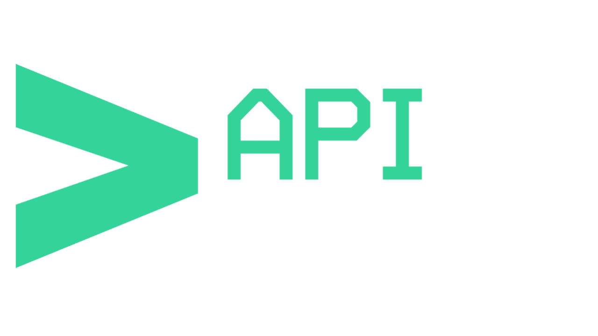

<p align="center">
  
</p>

# API20

API20 is an experimental discovery and testing layer for x402-powered APIs on Base.

It focuses on HTTP 402 payment inspection, API registry exploration, Base + USDC payment flow research, future MCP-ready agent workflows, and Builder Code / ERC-8021 attribution research.

> Status: early experimental development — **v0.3 Registry Metadata Layer**.

## v0.3 — Registry Metadata Layer

v0.3 introduces a structured registry metadata layer for x402-powered APIs.

This includes public registry JSON examples, API detail metadata, HTTP 402 response examples, curl examples, MCP-ready workflow fields, and Builder Code attribution research fields.

The production website frontend source is not included in this repository.

## Website

https://api20.xyz

## Community Token — $API20

**$API20** is the community token for API20 — live on **Base**. It exists to help grow the ecosystem around x402 API discovery, builder tooling, and agent-ready payment workflows on Base.

Holding or trading $API20 is optional and not required to use the website, docs, or planned CLI. If you choose to participate, do your own research and only use funds you can afford to lose.

| | |
|---|---|
| **Network** | Base |
| **Symbol** | `$API20` |
| **Contract** | `0x6049ef9dfb6186a87fe2e5643902cd90ba9f5ba3` |

### Trade $API20

| Platform | Link |
|----------|------|
| BANKR | [bankr.bot/terminal](https://bankr.bot/terminal/discover/0x6049ef9dfb6186a87fe2e5643902cd90ba9f5ba3) |
| GMGN.AI | [gmgn.ai/base/token](https://gmgn.ai/base/token/0x6049ef9dfb6186a87fe2e5643902cd90ba9f5ba3) |
| Uniswap | [Swap on Uniswap](https://app.uniswap.org/swap?chain=base&outputCurrency=0x6049ef9dfb6186a87fe2e5643902cd90ba9f5ba3) |
| Dexscreener | [Chart on Dexscreener](https://dexscreener.com/base/0x6049ef9dfb6186a87fe2e5643902cd90ba9f5ba3) |
| PancakeSwap | [Swap on PancakeSwap](https://pancakeswap.finance/swap?chain=base&outputCurrency=0x6049ef9dfb6186a87fe2e5643902cd90ba9f5ba3) |

Follow **[@tryAPI20 on X](https://x.com/tryAPI20)** for token updates, launches, and project news.

## Repository Scope

This public repository contains documentation, examples, schemas, roadmap notes, and public project references.

The production website frontend source is not included in this repository at this stage.

## Current Focus

* x402 API discovery
* HTTP 402 Payment Required inspection
* Base + USDC payment flow exploration
* API registry metadata
* MCP-ready agent workflow research
* Builder Codes / ERC-8021 attribution research
* MPP / Tempo compatibility research

## Planned Commands

```bash
api20 scan <url>
api20 inspect <url>
api20 registry
api20 registry export
api20 registry inspect <api-id>
api20 mcp <api>
api20 builder-code <api>
api20 demo
```

The installable CLI package is planned — not live yet. See [docs/commands.md](docs/commands.md).

Builder Code support is research/planned only. API20 does not currently append Builder Codes to real x402 settlement transactions.

## Documentation

| Doc | Description |
|-----|-------------|
| [Overview](docs/overview.md) | Project overview and positioning |
| [x402 Flow](docs/x402-flow.md) | HTTP 402 payment flow |
| [Commands](docs/commands.md) | Planned CLI reference |
| [Registry](docs/registry.md) | API registry preview |
| [Registry Schema](docs/registry-schema.md) | Registry entry schema |
| [Registry Metadata Layer](docs/registry-metadata-layer.md) | v0.3 structured metadata layer |
| [API Detail Pages](docs/api-detail-pages.md) | Per-API detail documentation |
| [MCP-ready Workflows](docs/mcp-ready-workflows.md) | Agent workflow research |
| [Builder Codes Research](docs/builder-codes.md) | ERC-8021 attribution metadata |
| [MPP / Tempo Research](docs/mpp-tempo-research.md) | Future compatibility research |
| [API Metadata](docs/api-metadata.md) | Payment and agent metadata |
| [Roadmap](docs/roadmap.md) | Development phases |
| [Status](STATUS.md) | What works today |
| [Changelog](CHANGELOG.md) | Version history |

## Links

| Channel | Link |
|---------|------|
| Website | [api20.xyz](https://api20.xyz) |
| Demo API | [server.api20.xyz](https://server.api20.xyz) |
| Token ($X402CLI) | [Dexscreener](https://dexscreener.com/base/0x6fBEb18fc6Ab14b170EcfB21c9a2f2384b155bA3) |
| X (updates) | [@tryAPI20](https://x.com/tryAPI20) |
| GitHub | [louismaxdubois/api20](https://github.com/louismaxdubois/api20) |

Follow **[@tryAPI20 on X](https://x.com/tryAPI20)** for development updates and announcements.

## Disclaimer

API20 is an independent experimental project. It is not affiliated with Coinbase, Base, Coinbase Developer Platform, Tempo, Stripe, or any official x402, MCP, or MPP organization.

See [DISCLAIMER.md](DISCLAIMER.md) for the full notice.

## License

[MIT License](LICENSE)
